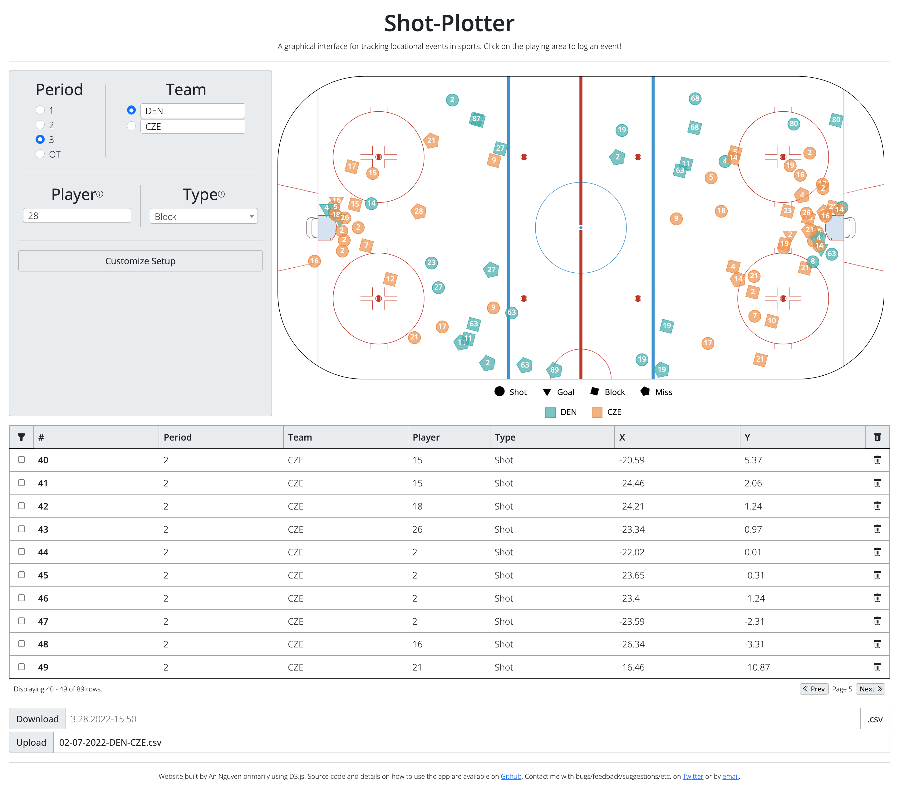
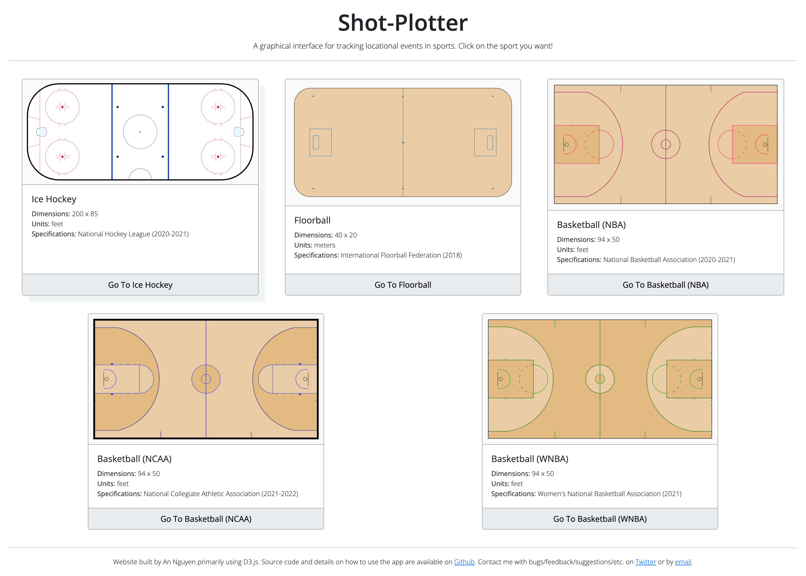

# Shot Plotter

**01/08/23: Ice hockey net, Australian rules football, rugby union, and table
tennis have been added as playing areas**

A [web application](https://shot-plotter.netlify.app/) for plotting events on a sport's playing area with a single click, while keeping track of any other details. The application supports download and upload of .csv files to retrieve that plotted data.

Currently 17 different playing areas across 12 different sports are supported: ice hockey (NHL, IIHF), ice hockey net (NHL), floorball (IFF), handball (IHF), volleyball (NCAA), table tennis (ITTF), basketball (NBA, NCAA, WNBA), men's lacrosse (NCAA), women's lacrosse (NCAA), American football (NFL, NCAA), soccer (NCAA), Australian rules football (AFL), and rugby union (World Rugby).

The web application is primarily built using D3.js.

### How to Use and Additional Information

From the main page, click on the sport/playing area you want. Each option has information about the specifications that describe that particular playing area, and its dimensions, which correspond to the coordinates.

#### Event Details

By default, four pieces of information can be specified for each event.

The period of the event can be logged through radio buttons.

The team can be specified through radio buttons and a text field that allows custom team names to be entered. The first team, which defaults to Home, corresponds to teal dots, and the second team, which defaults to Away, corresponds to orange dots. The legend below the rink clarifies which color corresponds to which team.

The player can be specified through a text field. If the player entry is 2 characters or less (for a player number, say), the player will appear on the event dot on the playing area.

The type of event can be specified, under Type or Outcome.Additional options can be specified by typing in the dropdown and selecting the new option that appears by clicking or pressing Enter. Each option corresponds to a different dot shape, as indicated by the legend below the rink.

Details logged for each event can be customized by clicking on the _Customize Details_ button at the bottom of the details panel. Details can only be customized when there are noevents recorded.

##### Customizing Setup

Clicking the _Customize Setup_ button will bring up a modal with a list of the current details. Drag-and-drop detail names to reorder them. Click on the eye icon to toggle whether it is visible. Click on the trash can icon to delete details. For created details, click on the pencil-in-a-square icon to edit those details. Reordering details changes their position in both the details panel and the table. The _X_ and _Y_ details cannot be hidden or deleted.

Special details can be added, which are details that do not take inputs but are specially calculated. Currently there a 3 types of special details:

-   **2-Location Events:** Using the _Enable 2-Location Events_ toggle, the ability to have 2-location events can be enabled. When enabled, _X2_ and _Y2_ details are added to the list of details. Like the _X_ and _Y_ details, the _X2_ and _Y2_ details cannot be hidden or deleted. When 2-location events are enabled, 2-location events can be plotted by either holding down the SHIFT button and clicking on two points in the playing area or by switching between 1-location and 2-location mode using the toggle above the playing area. This option is incompatible with Heat Map View.
-   **Distance:** For 1-location events, this detail will be the distance between the event and the closest net/hoop/end zone line center/etc. For 2-location events, this detail will be the be the distance between the two indicated locations.
-   **Shot Value (basketball only):** This detail is the number of points (2 or 3) a shot from the indicated location would be worth. For 2-location events, it will be the number of points for the second location.

There are several appearance options, which modify the appearance of the application but do not impact the data tracked. There are currently 3 appearance options:

-   **Widgets per Panel Row:** The number of widgets can be changed from its default value of 2 to 1 or 3 by choosing a new value in the dropdown labelled _Widgets per Panel Row_.
-   **Rows per Table Page:** The default number of events per table page can be modified by changing the number in the field labelled _Rows Per Table Page_. The default number is 10; the number must be an integer between 1 and 999 (inclusive).
-   **Heat Map View:** By toggling on the option labelled _Heat Map View_, the option for heat maps (2D density plots) view is enabled. This adds a toggle above the playing area that allows switching between the traditional view with event dots and view that shows the location density of events per team (if Team is a current detail). Two checkboxes below the toggle allow hiding and showing the heat map for each team. This option is incompatible with 2-Location Events.

Default details can be restored by clicking on the _Reset to Defaults_ button.

Details configurations can be saved or restored through download/upload. When a detail configuration is downloaded, it stores the current order and visibility of details, as well as any newly created details. Also, currently selected/entered options in the details panel are made the default options when the configuration is uploaded; if a detail is not visible, it preserves its original default value.

Clicking on the _Add Details_ Button allows creation of new details. There are four options for types of new details: radio buttons, text field, dropdown, and time widget. The name of all details must be 1-16 characters.

Radio buttons are limited to at most 5 options; each option must be between 1-32 characters and all options must be unique. The default value can be selected by checking the appropriate radio button.

For a text field, a default value can be entered and can be up to 32 characters.

For a dropdown, options are entered in a text area, with each option on a new line. Each option must be between 1-50 characters. The first option is the default selection. Unlike with the _Type_ detail, new options cannot be added from the details panel, though options can still be searched.

A time widget is a timer you can choose to have count up or countdown. The starting time can be inputted when creating the detail; times must be in the format MM:SS or M:SS, where (M)M is minutes and SS is seconds. When using the time widget in the details panel, the time can be edited any time the time widget is paused. The timer can be paused/started by clicking on the button next to the time.

#### Playing Area

To plot events, simply click on the playin area where the event happened. When clicked, a dot will be added of the appropriate color based on team, shape based on type, and text based on player, and a row will be made in the table.

The playing area matches the specifications from the governing body as specified on the main page. For all playing areas, the center of the playing area has coordinates (0,0), the positive x-axis is to the right, and the positive y-axis is upward.

Credit to [Bill Tran's guide on creating the NHL rink using TidyVerse](https://thewincolumn.ca/2021/01/15/r-tutorial-creating-an-nhl-rink-using-the-tidyverse/) for aid in interpreting the rule descriptions for the ice hockey rink and for the hex codes for the colors.

Massive credit to the [sportyR package](https://github.com/rossdrucker/sportyR) created by [Ross Drucker](https://twitter.com/rossdrucker9), using which the American Football fields (NFL and NCAA) were constructed.

The playing area size is not pinned to the window size. This allows you to zoom in and place the event exactly where you want it, but does mean the layout can become strange if you change your window size. Refreshing will readjust the size to match the current window size.

#### Table

The table logs the information for each event, as well as the row number of the event in the table. Events can be highlighted by clicking on the check box for the appropriate row. This will highlight the row in the matching team color, and both enlarge the dot on the rink and move it to the front if it was previously covered by other dots. Multiple events can be highlighted at once. Events can be deleted by clicking on the trash can in the appropriate row. All events can be deleted by clicking on the trash can in the header of the table; a prompt will confirm this choice.

The table, by default, shows the last page, which has the last 10 events recorded. Pages can be navigated using the _Prev_(ious) and _Next_ buttons at the lower-right of the table. The currently shown events and the total number of events recorded can be seen in the bottom-left of the table.

By click on the funnel icon in the header of the table, the filters become visible beneath the table headers and apply to the column in question. Multiple filters can be active at once; if there are multiple filters, only events that fit the criteria of all filters are visible. Events are filtered from both the table and playing area - in other words, events that do not fit the filter criteria are not visible as a row in the table or as a dot in the playing area. The form of the filter varies by the detail type:

-   **Numeric/Time (e.g. X, Y, #):** Numeric or time details will have a filter that takes a _minimum_ and a _maximum_ value and filters out any events with values for that detail not in the range specified. The range is inclusive of the minimum and maximum. If no value is specified for either the minimum or maximum, it is treated as if there is no limit in that direction. For example, if the minimum is indicated to be 4 and there is no maximum value indicated, only rows with a value of 4 or greater will be visible.
-   **Radio Buttons/Dropdown (e.g. Period, Team, Type):** Radio button and dropdown details will have a filter that takes the form of a dropdown and filters out any events with values not selected in the dropdown. If the dropdown has no selected options, it is as if the filter does not exist. It is possible to select multiple options in the dropdown filter; in this case, events with values corresponding to any currently selected in the dropdown will be visible. For example, if a dropdown filter currently has the values _Shot_ and _Goal_ selected, events with the value _Shot_ OR the value _Goal_ for that detail will be visible.
-   **Text (e.g. Player):** Text details will have a filter that is just a text box: any string that contains the string in the text box filter will satisfy the filter. If the string is surrounded in quote marks, double or single, instead only exact matches for the string satisfy the filter. For example, for the filter value _hat_, both _hate_ and _chat_ will be visible, but for the filter value _'hat'_ only the value 'hat' will suffice. It is also possible to use regular expressions in the text box filter for more complex text queries.

Clicking on the funnel icon will toggle whether the filters are visible. Filters are applied regardless of whether the filters are visible or not; hiding them does not remove all filters. When at least one filter is active and the filters are visible, a small X-in-a-square icon will appear near the funnel icon; clicking this X icon will clear all filters.

The number of currently filtered rows is also visible in the bottom left of the table.

#### Download/Upload Table

The event table information can be downloaded by pressing the _Download_ button. There is a text-field to customize the name of the file; otherwise, it defaults to the day and time when the web app was opened. Files are in .csv format, using comma separators, with the header row as it appears on the table, excluding _\#_, included in the file. When filters are active, only currently visible events that satisfy the filters are included in the file; this is indicated by the text of the button saying _Download Filter_ rather than just _Download_.

To initialize the table, a .csv file can be uploaded using the _Choose File_ button next to the Upload label. Only .csv files are permitted. The header row must exactly match the header row of the table, excluding _\#_, including order. Any custom shot types will be added in shot order. Custom teams will be added in order as they appear, alternating between the teal and orange team. This means if a shot by the orange team is logged first, when the file is downloaded and later uploaded, the team will be blue, but besides color there is no impact to the web app. _When a file is uploaded, any shots previously in the table are erased._

### Running Locally

To run the application locally, any method of running an HTTP server is needed to prevent browser issues with CORS (cross-origin requests - essentially not allowing the JS files to be loaded using the file:// protocol). Some methods include [http-server in Node.js](https://www.npmjs.com/package/http-server), [http.server in Python](https://docs.python.org/3/library/http.server.html), or even some browser-based options like the [Web Server for Chrome extension](https://chrome.google.com/webstore/detail/web-server-for-chrome/ofhbbkphhbklhfoeikjpcbhemlocgigb?hl=en), but any option will do.

Then, clone this repository; for most methods, it is sufficient to navigate into the repository folder and run the server, but check the exact way of starting a server for the chosen method. No additional packages need to be installed; additional packages are automatically acquired using CDNs.
