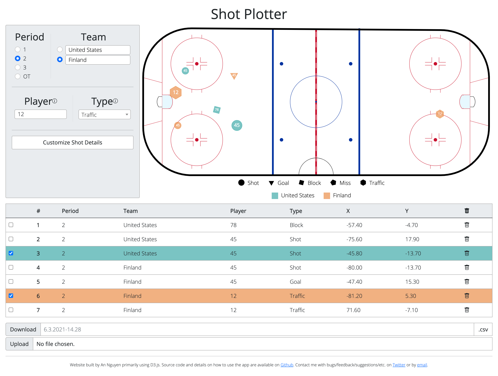

# Shot Plotter

A [web application](https://shot-plotter.netlify.app/) for plotting hockey shots with a single click, while keep track of the period, team, player and shot type. The application supports download and upload of .csv files to retrieve that plotted data.

The web application is primarily built using D3.js.

##### 6/19/21: You can now add a time widget column!

### How to Use and Additional Information

#### Shot Details

By default, four pieces of information can be specified for each shot.

The period of the shot can be logged through radio buttons (1, 2, 3, OT).

The team can be specified through radio buttons and a text field that allows custom team names to be entered. The first team, which defaults to Home, corresponds to teal dots, and the second team, which defaults to Away, corresponds to orange dots.

The player can be specified through a text field. If the player entry is 2 characters or less (for a player number, say), the player will appear on the shot dot on the rink.

The type of shot can be specified. There are four default options: shot, goal, block, and miss. Additional shot types can be specified by typing in the type dropdown and selecting the new option that appears by clicking or pressing Enter. Each shot corresponds to a different dot shape, as indicated by the legend below the rink.

Details logged for each shot can be customized by clicking on the _Customize Details_ button at the bottom of the details panel. Details can only be customized when there are no shots recorded.

##### Customizing Details

Clicking the _Customize Details_ button will bring up a modal with a list of the current details. Drag-and-drop detail names to reorder them. Click on the eye icon to toggle whether it is visible. Click on the trash can icon to delete details. For created details, click on the pencil-in-a-square icon to edit those details. Reordering details changes their position in both the details panel and the table. The _X_ and _Y_ details cannot be hidden or deleted.

Default details can be restored by clicking on the _Reset to Defaults_ button.

Details configurations can be saved or restored through download/upload. When a detail configuration is downloaded, it stores the current order and visibility of details, as well as any newly created details. Also, currently selected/entered options in the details panel are made the default options when the configuration is uploaded; if a detail is not visible, it preserves its original default value.

Clicking on the _Add Details_ Button allows creation of new details. There are three options for types of new details: radio buttons, text field, dropdown, and time widget. The name of all details must be 1-16 characters.

Radio buttons are limited to at most 5 options; each option must be between 1-32 characters and all options must be unique. The default value can be selected by checking the appropriate radio button.

For a text field, a default value can be entered and can be up to 32 characters.

For a dropdown, options are entered in a text area, with each option on a new line. Each option must be between 1-50 characters. The first option is the default selection. Unlike with the _Type_ detail, new options cannot be added from the details panel, though options can still be searched.

A time widget is a timer you can choose to have count up or countdown. The starting time can be inputted when creating the detail; times must be in the format MM:SS or M:SS, where (M)M is minutes and SS is seconds. When using the time widget in the details panel, the time can be edited any time the time widget is paused. The timer can be paused/started by clicking on the button next to the time.

#### Rink

To plot shots, simply click on the rink where the shot was made. When clicked, a dot will be added of the appropriate color, shape, and text based on the shot information entered, and a row will be made in the table.

The rink matches NHL specifications from the NHL rules. Rink coordinates match the x,y coordinate system in NHL data, with the origin at the center dot and the positive x-axis to the right and the positive y-axis upward.

Credit to [Bill Tran's guide on creating the NHL rink using TidyVerse](https://thewincolumn.ca/2021/01/15/r-tutorial-creating-an-nhl-rink-using-the-tidyverse/) for aid in interpreting the rule description and for the hex codes for the colors.

The rink size is not pinned to the window size. This allows you to zoom in and place the shot exactly where you want it, but does mean the layout can become strange if you change your window size. Refreshing will readjust the size to match the current window size.

#### Table

The table logs the information for each shot, as well as the row number of the shot in the table. Shots can be highlighted by clicking on the check box for the appropriate row. This will highlight the row in the matching team color, and both enlarge the dot on the rink and move it to the front if it was previously covered by other dots. Multiple shots can be highlighted at once. Shots can be deleted by clicking on the trash can in the appropriate row. All shots can be deleted by clicking on the trash can in the header of the table; a prompt will confirm this choice.

#### Download/Upload Table

The shot table information can be download by pressing the _Download_ button. There is a text-field to customize the name of the file; otherwise, it defaults to the day and time when the web app was opened. Files are in .csv format, using comma separators, with the header row as it appears on the table, excluding _\#_, included in the file.

To initialize the table, a .csv file can be uploaded using the _Choose File_ button next to the Upload label. Only .csv files are permitted. The header row must exactly match the header row of the table, excluding _\#_, including order. Any custom shot types will be added in shot order. Custom teams will be added in order as they appear, alternating between the teal and orange team. This means if a shot by the orange team is logged first, when the file is downloaded and later uploaded, the team will be blue, but besides color there is no impact to the web app. _When a file is uploaded, any shots previously in the table are erased._
